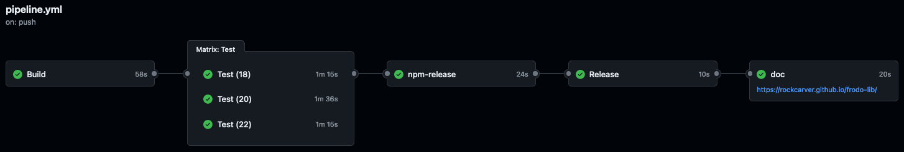

# Frodo Library Release Pipeline

The Frodo Library project uses an automated release pipeline defined in [../.github/workflows/pipeline.yml](../.github/workflows/pipeline.yml).



## Release Model

### Triggers

The workflow runs on:

- Pull requests to `main` (build + test validation)
- Pushes to `main` (build + test validation)
- Manual `workflow_dispatch` (release flow)

### Release Type Selection

Releases are explicit. Maintainers choose the release type from workflow input:

- `prerelease`
- `patch`
- `minor`
- `major`

There is no label-based or phrase-based bump logic in this pipeline.

### Dry Run Support

Manual runs include `dry-run`:

- `true`: computes versions and runs release logic without publishing, tagging, or creating GitHub releases
- `false`: performs the full release flow

## Jobs

### Build

Build does the following:

- Uses deep checkout with tags (`fetch-depth: 0`, `fetch-tags: true`)
- Computes next version with `vscheuber/version-bump-action@v1` (manual release runs)
- Updates manifests with `vscheuber/manifest-version-update-action@v1` (manual release runs)
- Builds library + docs and uploads `build.zip`

### Test

Test consumes `build.zip`, runs direct and proxy tests, and performs a production-focused security audit.

### npm-release

`npm-release` runs for manual release executions on `main` and uses trusted publishing via `vscheuber/npm-trusted-publish-action@v1`.

For stable release types (`patch`, `minor`, `major`), it performs dual publish:

- Publishes companion prerelease `x.y.z-n` to `next`
- Publishes stable `x.y.z` to `latest`

For `prerelease`, it publishes to `next`.

### Release

Release job:

- Generates and promotes changelog content with `vscheuber/ai-changelog-action@v1`
- Commits changelog/version/docs changes (unless `dry-run`)
- Creates and pushes tag with duplicate-tag safety checks
- Publishes GitHub release (unless `dry-run`)

GitHub release assets currently include:

- [../CHANGELOG.md](../CHANGELOG.md)
- [../LICENSE](../LICENSE)
- `Release.txt`

### Doc

Doc deployment runs after successful manual releases (and not in dry-run mode) and publishes docs to GitHub Pages.

## Operational Notes

- Pipeline behavior in forks can differ because secrets and permissions differ from the main repository.
- Keep release changes tested in the main repository release workflow before relying on them.

## Recovering From A Bad Release

If a bad release slips through:

1. Delete the incorrect GitHub release from the releases page.
2. Revert release content changes in [../CHANGELOG.md](../CHANGELOG.md), [../package.json](../package.json), and [../package-lock.json](../package-lock.json).
3. Merge the corrective PR.
4. Remove the incorrect npm version if needed:

   ```console
   npm unpublish @rockcarver/frodo-lib@<version>
   ```

5. Delete the incorrect Git tag if it blocks a corrected re-release:

   ```console
   git push --delete origin v<version>
   ```

6. Re-run the manual release workflow with the intended release type.