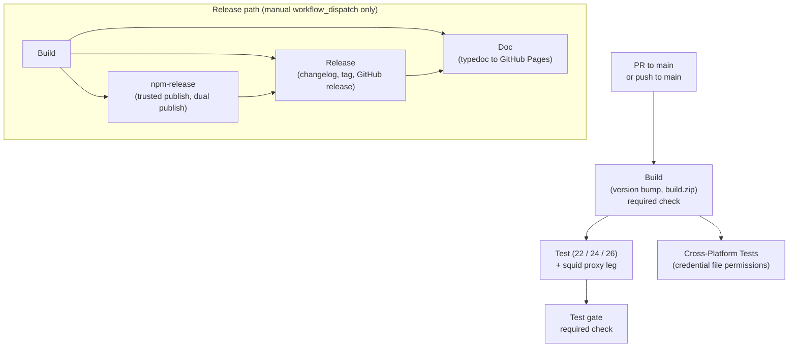

# Frodo Library Release Pipeline

The Frodo Library project uses an automated release pipeline defined in [../.github/workflows/pipeline.yml](../.github/workflows/pipeline.yml).

For the tools underneath the pipeline — bundler, the axios dts postinstall
patch, the TypeScript version policy, lint, and the maintenance history of
the build environment — see [BUILD-ENV.md](BUILD-ENV.md).

The pipeline diagram below is rendered by GitHub from the Mermaid source in
this file — it updates with the workflow itself and never goes stale like a
screenshot. (In renderers without Mermaid support, the same layout is
described in the job sections that follow.)


```mermaid
flowchart TD
    PR["PR to main<br/>or push to main"] --> B["Build<br/>(version bump, build.zip)<br/>required check"]
    B --> T["Test (22 / 24 / 26)<br/>+ squid proxy leg"]
    B --> CP["Cross-Platform Tests<br/>(credential file permissions)"]
    T --> TG["Test gate<br/>required check"]

    subgraph RELPATH ["Release path (manual workflow_dispatch only)"]
        B2["Build"] --> NR["npm-release<br/>(trusted publish, dual publish)"]
        B2 --> R["Release<br/>(changelog, tag, GitHub release)"]
        NR --> R
        B2 --> DOC["Doc<br/>(typedoc to GitHub Pages)"]
        R --> DOC
    end
```

## Release Model

### Triggers

The workflow runs on:

- **Pull requests to `main`** — build + test validation. Release jobs are
  skipped.
- **Pushes to `main`** — build + test validation. No publishing, no release.
- **Manual `workflow_dispatch`** — the full release flow.

### Release Type Selection

Releases are explicit. Maintainers choose the release type from workflow input:

- `prerelease`
- `premajor` — starts (or continues) an `X.0.0-1` prerelease train for the next major
- `patch`
- `minor`
- `major`

There is no label-based or phrase-based bump logic in this pipeline.

### Dry Run Support

Manual runs include `dry-run`:

- `true`: computes versions and runs release logic without publishing, tagging, or creating GitHub releases
- `false`: performs the full release flow

### Branch protection

The `main-branch-protection` ruleset requires three checks before anything
merges to `main`:

- `Build`
- `Test gate`
- `Cross-Platform Tests (Credential File Permissions)`

Release bot commits to `main` (changelog/version/docs updates) are covered
by the ruleset's bypass: the Release job authenticates with the org-wide
`FRODO_CI_PAT` fine-grained token (repository admin identity), whose pushes
the admin bypass admits. The GitHub Actions app cannot be a bypass actor —
`GITHUB_TOKEN` pushes to `main` are rejected by the required status checks.

## Jobs

### Build

Build does the following:

- Uses deep checkout with tags (`fetch-depth: 0`, `fetch-tags: true`)
- Computes next version with `vscheuber/version-bump-action@v1` (manual release runs)
- Updates manifests with `vscheuber/manifest-version-update-action@v1` (manual release runs)
- Runs `npm run check` (ESLint 10 + Prettier, including import order) and a
  critical-level security audit
- Builds library + docs and uploads `build.zip`

### Test

- **Test (22 / 24 / 26)**: the full jest suite (153 suites, 2,433 tests,
  927 snapshots) on each supported Node version, with a squid proxy service
  container: direct tests run normally, proxy tests run through the proxy,
  and a proxy leg failure triggers the diagnostic retry steps.
- **Cross-Platform Tests (Credential File Permissions)**: verifies the
  library creates credential files with restrictive permissions on Windows,
  macOS and Linux.

### Test gate

`Test gate` is a tiny aggregator job that runs after the `Test` matrix and
fails if **any** matrix leg failed. It exists because of how branch
protection works: the ruleset must name required checks exactly, and the
required-check name of a matrix job includes its matrix value
(`Test (22)`, `Test (24)` …). If the ruleset named those directly, every
Node version added or retired would require a ruleset edit. Instead the
ruleset requires the single, stable name `Test gate`, whose outcome is
derived from the whole matrix — so the Node version list can change freely
without ever touching repository settings.

The job uses `if: ${{ !cancelled() }}` so it still runs (and fails) when a
matrix leg is cancelled or skipped, which a plain `needs` alone would
silently accept.

### npm-release

`npm-release` runs for manual release executions on `main` and uses trusted publishing via `vscheuber/npm-trusted-publish-action@v1`.

For stable release types (`patch`, `minor`, `major`), it performs dual publish:

- Publishes companion prerelease `x.y.z-n` to `next`
- Publishes stable `x.y.z` to `latest`

For `prerelease`, it publishes to `next`.

### Release

Release job (needs build + npm-release):

- Generates and promotes changelog content with `vscheuber/ai-changelog-action@v1`
- Commits changelog/version/docs changes to `main` (pushed as the
  `FRODO_CI_PAT` identity — the repository admin the ruleset's bypass
  covers; a plain `GITHUB_TOKEN` push would be rejected by the required
  status checks, since the Actions app cannot be a bypass actor)
- Creates and pushes tag with duplicate-tag safety checks
- Publishes GitHub release (unless `dry-run`)

GitHub release assets currently include:

- [../CHANGELOG.md](../CHANGELOG.md)
- [../LICENSE](../LICENSE)
- `Release.txt`

### Doc

Doc deployment runs after successful manual releases (and not in dry-run
mode) and publishes the typedoc output to GitHub Pages.

## Operational Notes

- Pipeline behavior in forks can differ because secrets and permissions differ from the main repository.
- Keep release changes tested in the main repository release workflow before relying on them.
- Keep this document in sync with `pipeline.yml` — including the Mermaid
  diagram — as part of any pipeline change (same convention as
  [BUILD-ENV.md](BUILD-ENV.md)).

## Recovering From A Bad Release

If a bad release slips through:

1. Delete the incorrect GitHub release from the releases page.
2. Revert release content changes in [../CHANGELOG.md](../CHANGELOG.md), [../package.json](../package.json), and [../package-lock.json](../package-lock.json).
3. Merge the corrective PR.
4. Remove the incorrect npm version if needed:

   ```console
   npm unpublish @rockcarver/frodo-lib@<version>
   ```

5. Delete the incorrect Git tag if it blocks a corrected re-release:

   ```console
   git push --delete origin v<version>
   ```

6. Re-run the manual release workflow with the intended release type.
